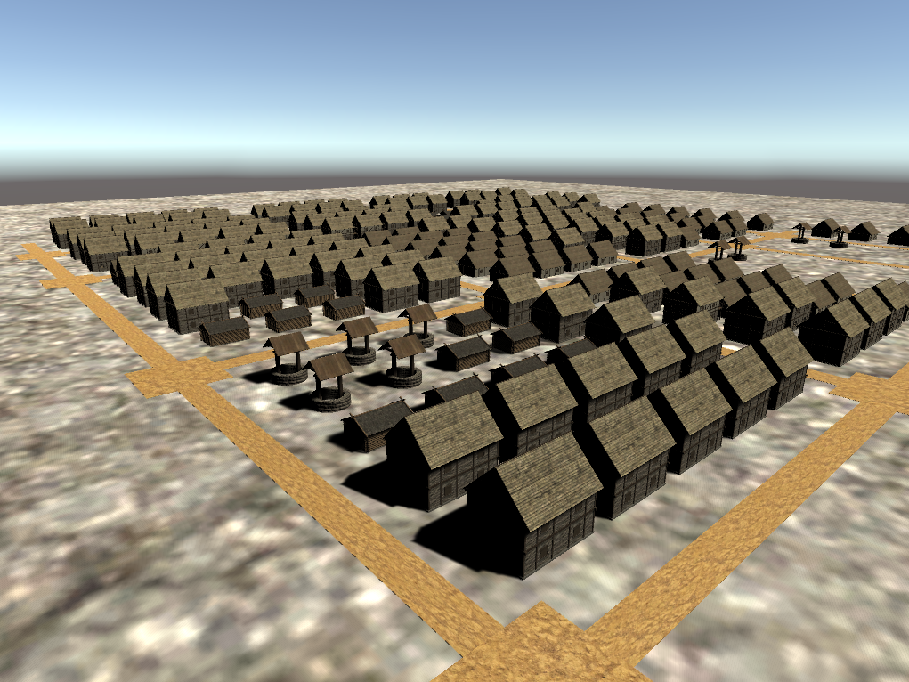
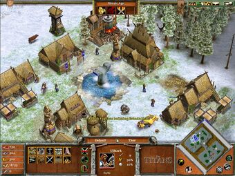
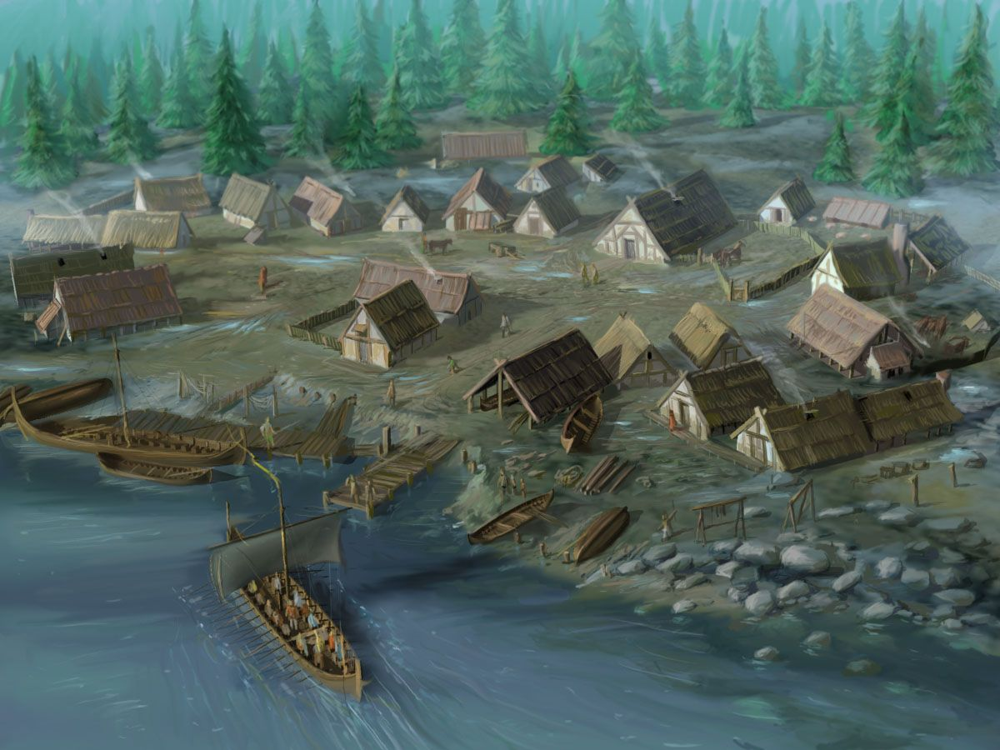

# CMPM163Lab7
Shader Graphics

Lab7

Video: https://drive.google.com/file/d/1qVVmzFjSuF1xgX8k1C2vnJOqEf_WvXfi/view?usp=sharing

I made my scene using the Shader Graphs on spheres, planes, lighting, and some free assets on the untiy store. To make the mountain range I applied some graph noise to the mesh similar to the tutorial and then made duplicates of that mesh while changing their scales to vary up the terrain. Finally I added a rotating light around the scene to better show the terrain.

Partner Check-In:  
 Question 1 - My partner did part 1.  
 Question 2 - My partner found going from coding to node based shaders was very difficult and hard to get the hang of.  
 Question 3 - My partner found that using a combination of shaders and materials to make the scene was that most interesting as it
              gave us more creative freedom.

-------------------------------------------------------------------------------------------

Lab8

For this lab I wanted to create a sort of norse/viking city or village and took insperation from a game called "Age of Mythology" and artwork. However since the houses are usually ordered around a center I wasn't sure how to accomplish that with perlin noise. So instead I created the a norse city with a more modern take with roads and compact space. I was trying to find a procedural generation of a single well every couple of blocks but was not able to get one. 

Reached out to partner, waiting for a response.
